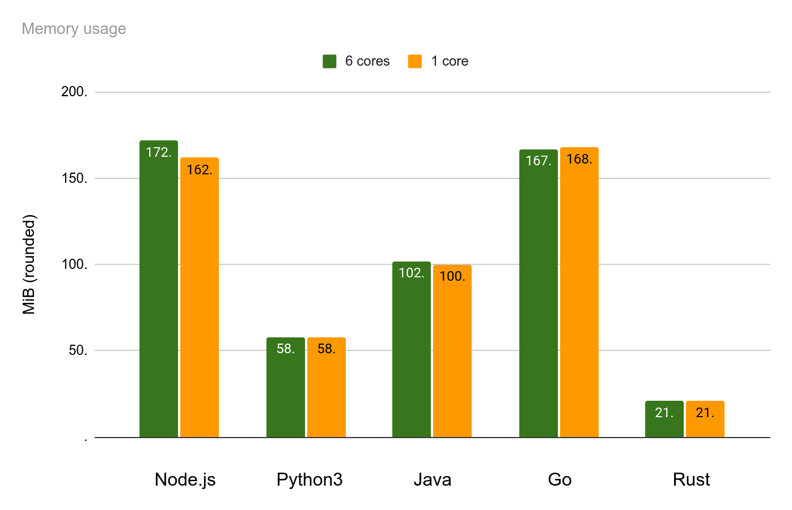

# Web  backend performance research

The goal of this project is to benchmark CPU and memory performance across different web development technologies. You can [run all the tests yourself](#how-to-run-the-tests) on a desired machine. Below are the results achieved on a [particular system configuration](#system-configuration). Please refer to section [Methodology](#methodology) for details and explanations.

If you achieve different results, want to share results for another configuration, or have any other feedback, please feel free to get in touch by starting a [github discussion](https://github.com/dipdowel/effective-computing/discussions). Thank you!

## Backend Results


**NB:** The tests do not involve multi-threading, however, the number of cores still influences the results due to the way each runtime environment operates.

The charts below are based on the following data:
- [CPU time, 6 cores + Memory usage](backend/app-reports/6-cores-data.md)
- [CPU time, 1 core + Memory usage](backend/app-reports/1-core-data.md)

### CPU time (cores: 6 vs. 1)


### Memory usage (cores: 6 vs. 1)



### Linear resource usage comparison 
#### 6 CPU cores

#### 1 CPU core


## System configuration

The test results shown above were achieved on an _x86_64 AMD Ryzen_ with 6 cores and 16GiB of RAM.

### CPU
```
Architecture:             x86_64
  CPU op-mode(s):         32-bit, 64-bit
  Address sizes:          48 bits physical, 48 bits virtual
  Byte Order:             Little Endian
CPU(s):                   6
  On-line CPU(s) list:    0-5
Vendor ID:                AuthenticAMD
  Model name:             AMD Ryzen 5
    Thread(s) per core:   1
    Core(s) per socket:   6
    Socket(s):            1
    Stepping:             1
    Frequency boost:      enabled
    CPU max MHz:          2375,0000
    CPU min MHz:          1400,0000

Caches (sum of all):      
  L1d:                    192 KiB (6 instances)
  L1i:                    192 KiB (6 instances)
  L2:                     3 MiB (6 instances)
  L3:                     8 MiB (2 instances)
```
### Memory
```
Memory block size:       128M
Total online memory:    15,5G
```

### Software
- Ubuntu 22.04.3 x86_64
- Node.js v20.10.0
- Python 3.10.12
- javac 22.0.2
- java version "22.0.2" 2024-07-16
- Java(TM) SE Runtime Environment (build 22.0.2+9-70)
- Java HotSpot(TM) 64-Bit Server VM (build 22.0.2+9-70, mixed mode, sharing)
- go version go1.23.1 linux/amd64
- rustc 1.80.1 (3f5fd8dd4 2024-08-06)
- cargo 1.80.1 (376290515 2024-07-16)


# How to run the tests


## Prerequisites
- A Linux operating system or compatible
- unzip
- JRE (Java Runtime Environment)
- JDK (Java Development Kit)
- Node.js
- Python3
- GoLang tooling
- Rust toolchain (rustc, cargo, etc.)

## Quick start
1. Clone this repo
2. Make sure all the prerequisites mentioned above are installed
3. `cd efficient-computing/backend && chmod +x init && ./init && chmod +x run-tests`
4. `./run-tests` 

**NB:** `./run-tests 7`  will run each test 7 times, i.e. you can specify how many times each test should run by providing a positive integer as an argument. 


## Methodology

In an effort to compare performance of backend programs written in [Python3](backend/python/text-freq.py), [Node.js](backend/node-js/text-freq.js), [Java](backend/java/WordCount.java), [Go](backend/go/text-freq.go), and [Rust](backend/rust/src/main.rs), a benchmark was conducted using a common text-processing task. Each program reads a large text file (~100 MiB) containing a compilation of movie reviews from IMDB, calculates the frequency of each word, and writes the frequencies to an output file. This task is representative of typical backend workloads involving I/O operations, text processing, data manipulation and memory management.

The input data was made by concatenation of files from the [Large Movie Review Dataset](https://ai.stanford.edu/~amaas/data/sentiment/), published by [Andrew Maas](https://ai.stanford.edu/~amaas/).


### CPU cores
The tests were executed on a machine with 6 CPU cores twice:
1. With all the 6 cores enabled
2. With just once core enabled, to simulate a low-end system (e.g. an embedded one).

### Program Execution

- **Consistency Across Languages**: Similar algorithms and logic were implemented in each language to ensure that performance differences are attributable to the language and its runtime, rather than the implementation.
- **Input and Output**: Each program accepts the same input file  and writes the results to an output file.

### Performance Measurement

- **Execution Command**: The programs were executed using `/usr/bin/time` to capture detailed performance metrics.

- **Metrics Collected**:
  - **Memory Usage**: The maximum resident set size (memory usage) in KiB.
  - **CPU Time**:
    - **Real Time**: The elapsed wall-clock time in seconds.
    - **User Time**: The total number of CPU-seconds spent in user mode.
    - **System Time**: The total number of CPU-seconds spent in kernel mode.
  - **CPU Usage Percentage**: The percentage of CPU utilization.
  - **Involuntary Context Switches**: The number of times the process was context-switched involuntarily.
  - **Swaps**: The number of times the process was swapped out of main memory.
  - **Exit Status**: The exit status of the command.

#### CPU time interpretation

If the `real` time is less than the combined `user` and `sys` times, it might mean that the system has multiple CPU cores. In this case, the program was able to use more than one CPU core concurrently. Thus, while the wall-clock time is 3.4 seconds, the program used enough CPU resources across multiple cores to total 5.6 seconds in user mode and 0.4 seconds in kernel mode.

If the system has just a single core, then it is expected the `real` time to be at least as large as the sum of `user` and `sys` times.

#### Averaging
Each program was executed **seven times** consecutively to account for variability in system performance and to mitigate external factors affecting execution time.
- **Statistical Significance**: Running each program multiple times and averaging results reduces the impact of outliers caused by background processes or system interrupts.
- **Memory Usage**: The maximum memory usage from each run was recorded and averaged over the seven runs.
- **CPU Real Time**: The real elapsed time was averaged to provide a consistent measure of execution time.


### Representativeness of the Task

- **Real-World Applicability**: Text processing and word frequency analysis are common tasks in data analytics, natural language processing, and backend services that handle log processing or search indexing.
- **I/O and CPU Bound**: The task involves both input/output operations  and CPU-bound computations (parsing text, counting words, sorting).

- **Similar Algorithm Across Languages**: By implementing the same algorithm, differences in performance can be attributed to the language's execution efficiency, compiler optimizations, and runtime characteristics.
- **Isolation of Variables**: External factors like network latency, database access, or third-party libraries are excluded, focusing solely on language and runtime performance.
 
### Performance Indicators

- **CPU and Memory Usage**: Backend applications often need to be optimized for both speed and resource utilization. Measuring both provides a holistic view of performance.
- **Context Switches and Swaps**: These metrics offer insights into how efficiently the program interacts with the operating system, affecting scalability and responsiveness.

### Realistic Environment

- **Large Data Set**: Using a 100 MiB input file ensures that the program handles substantial data, revealing how each language manages memory and processing under load.
- **Disk I/O Consideration**: Reading from and writing to disk simulates real-world backend workloads where data persistence is essential.

### Cross-Language Insights

- **Interpreted vs. Compiled Languages**: Comparing languages like Python (interpreted) with GoLang and Rust (compiled) highlights the trade-offs between development speed and execution efficiency.
- **Runtime and Garbage Collection**: The impact of language runtimes and garbage collection mechanisms becomes evident, informing decisions about language choice based on performance needs.

### Practical Relevance

- **Backend Optimization**: For developers and engineers, understanding how different languages perform with common tasks aids in selecting the right tool for performance-critical applications.
- **Resource Allocation**: Organizations can make informed decisions about resource provisioning based on the memory and CPU requirements of applications written in different languages.


### Source code complexity

Source code linked in the table below

| written in | lines of code   |
|------------|-----------------|
| [Python3](backend/python/text-freq.py)| ~35|
| [Node.js](backend/node-js/text-freq.js)| ~45|
| [Java](backend/java/WordCount.java)| ~65|
| [Go](backend/go/text-freq.go)| ~80|
| [Rust](backend/rust/src/main.rs)| ~60|
 
