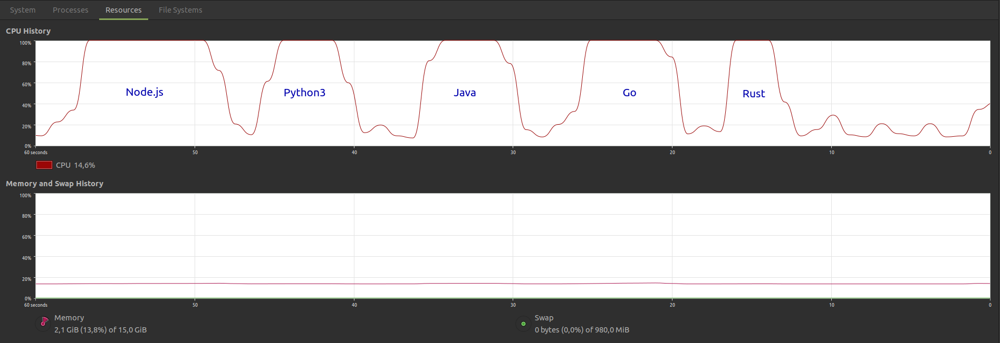
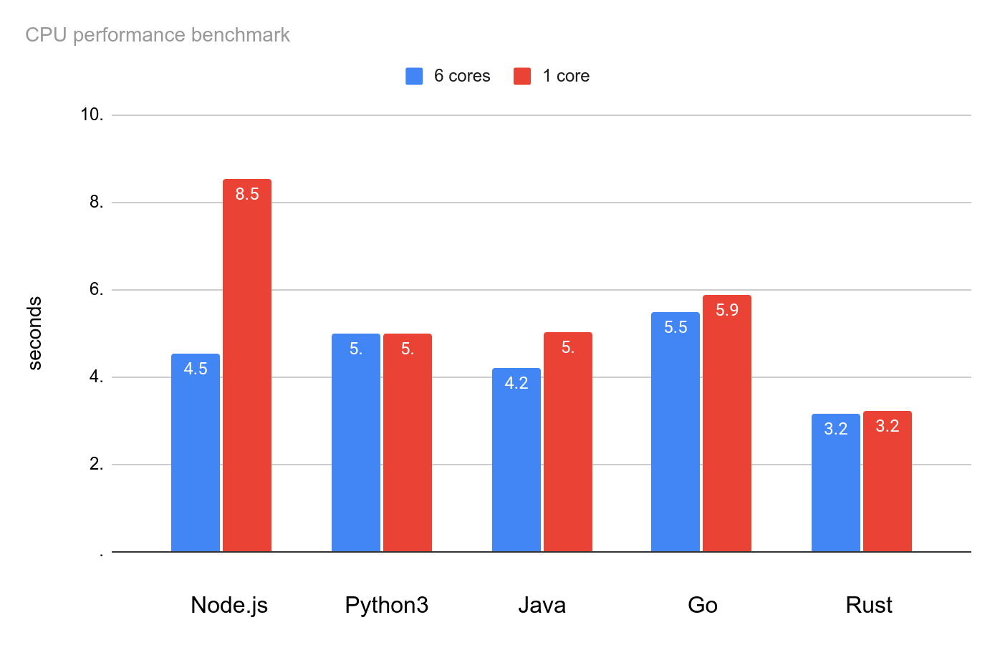

# CPU time (1 core), memory usage



Disabling 5 out of 6 cores turned the CPU into a single-core one.
### Disable a core
```sh
echo 0 | sudo tee /sys/devices/system/cpu/cpu<N>/online
```

### Enable a core
```sh
echo 1 | sudo tee /sys/devices/system/cpu/cpu<N>/online
```
### `cpu<N>`
Replace `cpu<N>` with a core that needs to be disabled/enabled, e.g. `cpu1`, `cpu2`, `cpu3`, etc.


## Node.JS
```
Execution #1
Memory, KiB:		 162248
CPU, seconds:
		real	 8.40
		user	 4.16
		 sys	 4.07
CPU usage: 98%, Involuntary context switches: 10245, Swaps: 0, Exit status: 0
-rw-rw-r-- 1 amd amd 2507176 sep 15 13:53 output

Execution #2
Memory, KiB:		 162160
CPU, seconds:
		real	 8.33
		user	 4.10
		 sys	 4.10
CPU usage: 98%, Involuntary context switches: 10147, Swaps: 0, Exit status: 0
-rw-rw-r-- 1 amd amd 2507176 sep 15 13:53 output

Execution #3
Memory, KiB:		 161900
CPU, seconds:
		real	 8.93
		user	 4.32
		 sys	 4.30
CPU usage: 96%, Involuntary context switches: 10794, Swaps: 0, Exit status: 0
-rw-rw-r-- 1 amd amd 2507176 sep 15 13:53 output

Execution #4
Memory, KiB:		 176976
CPU, seconds:
		real	 8.42
		user	 4.14
		 sys	 4.11
CPU usage: 98%, Involuntary context switches: 10215, Swaps: 0, Exit status: 0
-rw-rw-r-- 1 amd amd 2507176 sep 15 13:53 output

Execution #5
Memory, KiB:		 161628
CPU, seconds:
		real	 8.77
		user	 4.35
		 sys	 4.29
CPU usage: 98%, Involuntary context switches: 10569, Swaps: 0, Exit status: 0
-rw-rw-r-- 1 amd amd 2507176 sep 15 13:54 output

Execution #6
Memory, KiB:		 176620
CPU, seconds:
		real	 8.45
		user	 4.13
		 sys	 4.12
CPU usage: 97%, Involuntary context switches: 10091, Swaps: 0, Exit status: 0
-rw-rw-r-- 1 amd amd 2507176 sep 15 13:54 output

Execution #7
Memory, KiB:		 162452
CPU, seconds:
		real	 8.44
		user	 4.13
		 sys	 4.08
CPU usage: 97%, Involuntary context switches: 10104, Swaps: 0, Exit status: 0
-rw-rw-r-- 1 amd amd 2507176 sep 15 13:54 output
```


## Python3
```
Execution #1
Memory, KiB:		 59284
CPU, seconds:
		real	 5.01
		user	 4.87
		 sys	 0.04
CPU usage: 98%, Involuntary context switches: 2434, Swaps: 0, Exit status: 0
-rw-rw-r-- 1 amd amd 2507176 sep 15 13:54 output

Execution #2
Memory, KiB:		 59284
CPU, seconds:
		real	 4.97
		user	 4.84
		 sys	 0.05
CPU usage: 98%, Involuntary context switches: 2402, Swaps: 0, Exit status: 0
-rw-rw-r-- 1 amd amd 2507176 sep 15 13:54 output

Execution #3
Memory, KiB:		 59284
CPU, seconds:
		real	 4.92
		user	 4.80
		 sys	 0.04
CPU usage: 98%, Involuntary context switches: 2397, Swaps: 0, Exit status: 0
-rw-rw-r-- 1 amd amd 2507176 sep 15 13:54 output

Execution #4
Memory, KiB:		 59156
CPU, seconds:
		real	 4.95
		user	 4.82
		 sys	 0.04
CPU usage: 98%, Involuntary context switches: 2418, Swaps: 0, Exit status: 0
-rw-rw-r-- 1 amd amd 2507176 sep 15 13:54 output

Execution #5
Memory, KiB:		 59156
CPU, seconds:
		real	 5.04
		user	 4.91
		 sys	 0.04
CPU usage: 98%, Involuntary context switches: 2506, Swaps: 0, Exit status: 0
-rw-rw-r-- 1 amd amd 2507176 sep 15 13:54 output

Execution #6
Memory, KiB:		 59156
CPU, seconds:
		real	 5.07
		user	 4.86
		 sys	 0.04
CPU usage: 96%, Involuntary context switches: 2448, Swaps: 0, Exit status: 0
-rw-rw-r-- 1 amd amd 2507176 sep 15 13:54 output

Execution #7
Memory, KiB:		 59028
CPU, seconds:
		real	 5.02
		user	 4.89
		 sys	 0.04
CPU usage: 98%, Involuntary context switches: 2480, Swaps: 0, Exit status: 0
-rw-rw-r-- 1 amd amd 2507176 sep 15 13:55 output
```


## Java
```
Execution #1
Memory, KiB:		 102168
CPU, seconds:
		real	 4.96
		user	 4.67
		 sys	 0.19
CPU usage: 98%, Involuntary context switches: 3991, Swaps: 0, Exit status: 0
-rw-rw-r-- 1 amd amd 2507176 sep 15 13:55 output

Execution #2
Memory, KiB:		 102204
CPU, seconds:
		real	 4.89
		user	 4.69
		 sys	 0.11
CPU usage: 98%, Involuntary context switches: 3874, Swaps: 0, Exit status: 0
-rw-rw-r-- 1 amd amd 2507176 sep 15 13:55 output

Execution #3
Memory, KiB:		 103064
CPU, seconds:
		real	 5.14
		user	 4.95
		 sys	 0.10
CPU usage: 98%, Involuntary context switches: 4052, Swaps: 0, Exit status: 0
-rw-rw-r-- 1 amd amd 2507176 sep 15 13:55 output

Execution #4
Memory, KiB:		 102040
CPU, seconds:
		real	 5.19
		user	 4.97
		 sys	 0.12
CPU usage: 98%, Involuntary context switches: 4008, Swaps: 0, Exit status: 0
-rw-rw-r-- 1 amd amd 2507176 sep 15 13:55 output

Execution #5
Memory, KiB:		 101364
CPU, seconds:
		real	 5.10
		user	 4.76
		 sys	 0.12
CPU usage: 95%, Involuntary context switches: 4100, Swaps: 0, Exit status: 0
-rw-rw-r-- 1 amd amd 2507176 sep 15 13:55 output

Execution #6
Memory, KiB:		 102072
CPU, seconds:
		real	 4.91
		user	 4.69
		 sys	 0.12
CPU usage: 98%, Involuntary context switches: 3918, Swaps: 0, Exit status: 0
-rw-rw-r-- 1 amd amd 2507176 sep 15 13:55 output

Execution #7
Memory, KiB:		 102816
CPU, seconds:
		real	 5.02
		user	 4.80
		 sys	 0.12
CPU usage: 98%, Involuntary context switches: 4110, Swaps: 0, Exit status: 0
-rw-rw-r-- 1 amd amd 2507176 sep 15 13:55 output
```

## Go

```
Execution #1
Memory, KiB:		 172028
CPU, seconds:
		real	 5.75
		user	 5.56
		 sys	 0.09
CPU usage: 98%, Involuntary context switches: 3465, Swaps: 0, Exit status: 0
-rw-rw-r-- 1 amd amd 2507177 sep 15 13:55 output

Execution #2
Memory, KiB:		 175664
CPU, seconds:
		real	 5.74
		user	 5.55
		 sys	 0.10
CPU usage: 98%, Involuntary context switches: 3434, Swaps: 0, Exit status: 0
-rw-rw-r-- 1 amd amd 2507177 sep 15 13:55 output

Execution #3
Memory, KiB:		 170924
CPU, seconds:
		real	 6.64
		user	 5.59
		 sys	 0.13
CPU usage: 86%, Involuntary context switches: 4355, Swaps: 0, Exit status: 0
-rw-rw-r-- 1 amd amd 2507177 sep 15 13:55 output

Execution #4
Memory, KiB:		 173248
CPU, seconds:
		real	 5.78
		user	 5.53
		 sys	 0.11
CPU usage: 97%, Involuntary context switches: 3410, Swaps: 0, Exit status: 0
-rw-rw-r-- 1 amd amd 2507177 sep 15 13:55 output

Execution #5
Memory, KiB:		 172140
CPU, seconds:
		real	 5.72
		user	 5.55
		 sys	 0.09
CPU usage: 98%, Involuntary context switches: 3273, Swaps: 0, Exit status: 0
-rw-rw-r-- 1 amd amd 2507177 sep 15 13:56 output

Execution #6
Memory, KiB:		 171056
CPU, seconds:
		real	 5.75
		user	 5.49
		 sys	 0.16
CPU usage: 98%, Involuntary context switches: 3346, Swaps: 0, Exit status: 0
-rw-rw-r-- 1 amd amd 2507177 sep 15 13:56 output

Execution #7
Memory, KiB:		 172036
CPU, seconds:
		real	 5.73
		user	 5.53
		 sys	 0.11
CPU usage: 98%, Involuntary context switches: 3381, Swaps: 0, Exit status: 0
-rw-rw-r-- 1 amd amd 2507177 sep 15 13:56 output

```


## Rust

```
Execution #1
Memory, KiB:		 21368
CPU, seconds:
		real	 3.19
		user	 2.70
		 sys	 0.42
CPU usage: 97%, Involuntary context switches: 1516, Swaps: 0, Exit status: 0
-rw-rw-r-- 1 amd amd 2507176 sep 15 13:56 output

Execution #2
Memory, KiB:		 21372
CPU, seconds:
		real	 3.17
		user	 2.69
		 sys	 0.44
CPU usage: 99%, Involuntary context switches: 1517, Swaps: 0, Exit status: 0
-rw-rw-r-- 1 amd amd 2507176 sep 15 13:56 output

Execution #3
Memory, KiB:		 21368
CPU, seconds:
		real	 3.30
		user	 2.73
		 sys	 0.43
CPU usage: 95%, Involuntary context switches: 1680, Swaps: 0, Exit status: 0
-rw-rw-r-- 1 amd amd 2507176 sep 15 13:56 output

Execution #4
Memory, KiB:		 21372
CPU, seconds:
		real	 3.26
		user	 2.71
		 sys	 0.43
CPU usage: 96%, Involuntary context switches: 1637, Swaps: 0, Exit status: 0
-rw-rw-r-- 1 amd amd 2507176 sep 15 13:56 output

Execution #5
Memory, KiB:		 21372
CPU, seconds:
		real	 3.16
		user	 2.69
		 sys	 0.44
CPU usage: 99%, Involuntary context switches: 1519, Swaps: 0, Exit status: 0
-rw-rw-r-- 1 amd amd 2507176 sep 15 13:56 output

Execution #6
Memory, KiB:		 21368
CPU, seconds:
		real	 3.19
		user	 2.69
		 sys	 0.44
CPU usage: 97%, Involuntary context switches: 1569, Swaps: 0, Exit status: 0
-rw-rw-r-- 1 amd amd 2507176 sep 15 13:56 output

Execution #7
Memory, KiB:		 21372
CPU, seconds:
		real	 3.23
		user	 2.72
		 sys	 0.44
CPU usage: 97%, Involuntary context switches: 1571, Swaps: 0, Exit status: 0
-rw-rw-r-- 1 amd amd 2507176 sep 15 13:56 output
```

