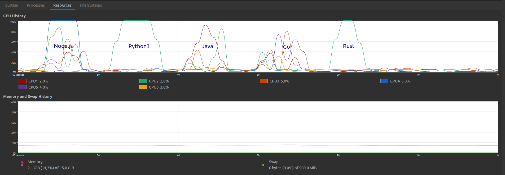

# CPU time (6 cores), memory usage



## Node.JS
```
Execution #1
Memory, KiB:		 176832
CPU, seconds:
		real	 4.53
		user	 4.46
		 sys	 4.33
CPU usage: 193%, Involuntary context switches: 3318, Swaps: 0, Exit status: 0
-rw-rw-r-- 1 amd amd 2507176 sep 15 13:47 output

Execution #2
Memory, KiB:		 175752
CPU, seconds:
		real	 4.52
		user	 4.46
		 sys	 4.30
CPU usage: 193%, Involuntary context switches: 3514, Swaps: 0, Exit status: 0
-rw-rw-r-- 1 amd amd 2507176 sep 15 13:47 output

Execution #3
Memory, KiB:		 176932
CPU, seconds:
		real	 4.53
		user	 4.44
		 sys	 4.34
CPU usage: 193%, Involuntary context switches: 3428, Swaps: 0, Exit status: 0
-rw-rw-r-- 1 amd amd 2507176 sep 15 13:47 output

Execution #4
Memory, KiB:		 174720
CPU, seconds:
		real	 4.54
		user	 4.47
		 sys	 4.35
CPU usage: 194%, Involuntary context switches: 3473, Swaps: 0, Exit status: 0
-rw-rw-r-- 1 amd amd 2507176 sep 15 13:47 output

Execution #5
Memory, KiB:		 175880
CPU, seconds:
		real	 4.52
		user	 4.44
		 sys	 4.33
CPU usage: 193%, Involuntary context switches: 3341, Swaps: 0, Exit status: 0
-rw-rw-r-- 1 amd amd 2507176 sep 15 13:48 output

Execution #6
Memory, KiB:		 175660
CPU, seconds:
		real	 4.53
		user	 4.46
		 sys	 4.33
CPU usage: 194%, Involuntary context switches: 3338, Swaps: 0, Exit status: 0
-rw-rw-r-- 1 amd amd 2507176 sep 15 13:48 output

Execution #7
Memory, KiB:		 177116
CPU, seconds:
		real	 4.53
		user	 4.46
		 sys	 4.33
CPU usage: 194%, Involuntary context switches: 3342, Swaps: 0, Exit status: 0
-rw-rw-r-- 1 amd amd 2507176 sep 15 13:48 output
```


## Python3
```
Execution #1
Memory, KiB:		 59280
CPU, seconds:
		real	 5.05
		user	 4.99
		 sys	 0.05
CPU usage: 99%, Involuntary context switches: 1945, Swaps: 0, Exit status: 0
-rw-rw-r-- 1 amd amd 2507176 sep 15 13:48 output

Execution #2
Memory, KiB:		 59156
CPU, seconds:
		real	 5.07
		user	 5.01
		 sys	 0.04
CPU usage: 99%, Involuntary context switches: 2163, Swaps: 0, Exit status: 0
-rw-rw-r-- 1 amd amd 2507176 sep 15 13:48 output

Execution #3
Memory, KiB:		 59280
CPU, seconds:
		real	 4.96
		user	 4.89
		 sys	 0.05
CPU usage: 99%, Involuntary context switches: 2153, Swaps: 0, Exit status: 0
-rw-rw-r-- 1 amd amd 2507176 sep 15 13:48 output

Execution #4
Memory, KiB:		 59028
CPU, seconds:
		real	 4.93
		user	 4.87
		 sys	 0.04
CPU usage: 99%, Involuntary context switches: 1897, Swaps: 0, Exit status: 0
-rw-rw-r-- 1 amd amd 2507176 sep 15 13:48 output

Execution #5
Memory, KiB:		 59284
CPU, seconds:
		real	 5.06
		user	 4.99
		 sys	 0.05
CPU usage: 99%, Involuntary context switches: 2180, Swaps: 0, Exit status: 0
-rw-rw-r-- 1 amd amd 2507176 sep 15 13:48 output

Execution #6
Memory, KiB:		 59028
CPU, seconds:
		real	 4.97
		user	 4.92
		 sys	 0.04
CPU usage: 99%, Involuntary context switches: 1913, Swaps: 0, Exit status: 0
-rw-rw-r-- 1 amd amd 2507176 sep 15 13:48 output

Execution #7
Memory, KiB:		 59156
CPU, seconds:
		real	 4.93
		user	 4.88
		 sys	 0.03
CPU usage: 99%, Involuntary context switches: 2161, Swaps: 0, Exit status: 0
-rw-rw-r-- 1 amd amd 2507176 sep 15 13:48 output
```


## Java
```
Execution #1
Memory, KiB:		 104580
CPU, seconds:
		real	 4.14
		user	 4.93
		 sys	 0.11
CPU usage: 121%, Involuntary context switches: 1868, Swaps: 0, Exit status: 0
-rw-rw-r-- 1 amd amd 2507176 sep 15 13:48 output

Execution #2
Memory, KiB:		 103788
CPU, seconds:
		real	 4.20
		user	 4.99
		 sys	 0.12
CPU usage: 121%, Involuntary context switches: 1860, Swaps: 0, Exit status: 0
-rw-rw-r-- 1 amd amd 2507176 sep 15 13:48 output

Execution #3
Memory, KiB:		 104076
CPU, seconds:
		real	 4.16
		user	 4.91
		 sys	 0.15
CPU usage: 121%, Involuntary context switches: 1878, Swaps: 0, Exit status: 0
-rw-rw-r-- 1 amd amd 2507176 sep 15 13:48 output

Execution #4
Memory, KiB:		 104032
CPU, seconds:
		real	 4.44
		user	 5.25
		 sys	 0.14
CPU usage: 121%, Involuntary context switches: 1997, Swaps: 0, Exit status: 0
-rw-rw-r-- 1 amd amd 2507176 sep 15 13:49 output

Execution #5
Memory, KiB:		 104476
CPU, seconds:
		real	 4.12
		user	 4.89
		 sys	 0.14
CPU usage: 122%, Involuntary context switches: 1815, Swaps: 0, Exit status: 0
-rw-rw-r-- 1 amd amd 2507176 sep 15 13:49 output

Execution #6
Memory, KiB:		 103768
CPU, seconds:
		real	 4.31
		user	 5.08
		 sys	 0.12
CPU usage: 120%, Involuntary context switches: 2031, Swaps: 0, Exit status: 0
-rw-rw-r-- 1 amd amd 2507176 sep 15 13:49 output

Execution #7
Memory, KiB:		 103912
CPU, seconds:
		real	 4.07
		user	 4.83
		 sys	 0.14
CPU usage: 121%, Involuntary context switches: 1805, Swaps: 0, Exit status: 0
-rw-rw-r-- 1 amd amd 2507176 sep 15 13:49 output
```

## Go

```
Execution #1
Memory, KiB:		 171852
CPU, seconds:
		real	 5.48
		user	 5.66
		 sys	 0.13
CPU usage: 105%, Involuntary context switches: 2263, Swaps: 0, Exit status: 0
-rw-rw-r-- 1 amd amd 2507177 sep 15 13:49 output

Execution #2
Memory, KiB:		 171264
CPU, seconds:
		real	 5.47
		user	 5.65
		 sys	 0.12
CPU usage: 105%, Involuntary context switches: 2188, Swaps: 0, Exit status: 0
-rw-rw-r-- 1 amd amd 2507177 sep 15 13:49 output

Execution #3
Memory, KiB:		 171700
CPU, seconds:
		real	 5.48
		user	 5.65
		 sys	 0.13
CPU usage: 105%, Involuntary context switches: 2165, Swaps: 0, Exit status: 0
-rw-rw-r-- 1 amd amd 2507177 sep 15 13:49 output

Execution #4
Memory, KiB:		 167996
CPU, seconds:
		real	 5.47
		user	 5.65
		 sys	 0.14
CPU usage: 105%, Involuntary context switches: 2150, Swaps: 0, Exit status: 0
-rw-rw-r-- 1 amd amd 2507177 sep 15 13:49 output

Execution #5
Memory, KiB:		 171756
CPU, seconds:
		real	 5.48
		user	 5.66
		 sys	 0.12
CPU usage: 105%, Involuntary context switches: 2233, Swaps: 0, Exit status: 0
-rw-rw-r-- 1 amd amd 2507177 sep 15 13:49 output

Execution #6
Memory, KiB:		 172744
CPU, seconds:
		real	 5.50
		user	 5.69
		 sys	 0.12
CPU usage: 105%, Involuntary context switches: 2247, Swaps: 0, Exit status: 0
-rw-rw-r-- 1 amd amd 2507177 sep 15 13:49 output

Execution #7
Memory, KiB:		 170952
CPU, seconds:
		real	 5.50
		user	 5.68
		 sys	 0.14
CPU usage: 105%, Involuntary context switches: 2177, Swaps: 0, Exit status: 0
-rw-rw-r-- 1 amd amd 2507177 sep 15 13:49 output
```


## Rust

```
Execution #1
Memory, KiB:		 21368
CPU, seconds:
		real	 3.16
		user	 2.72
		 sys	 0.43
CPU usage: 99%, Involuntary context switches: 1209, Swaps: 0, Exit status: 0
-rw-rw-r-- 1 amd amd 2507176 sep 15 13:49 output

Execution #2
Memory, KiB:		 21368
CPU, seconds:
		real	 3.16
		user	 2.71
		 sys	 0.44
CPU usage: 99%, Involuntary context switches: 1229, Swaps: 0, Exit status: 0
-rw-rw-r-- 1 amd amd 2507176 sep 15 13:49 output

Execution #3
Memory, KiB:		 21368
CPU, seconds:
		real	 3.15
		user	 2.70
		 sys	 0.43
CPU usage: 99%, Involuntary context switches: 1211, Swaps: 0, Exit status: 0
-rw-rw-r-- 1 amd amd 2507176 sep 15 13:50 output

Execution #4
Memory, KiB:		 21368
CPU, seconds:
		real	 3.15
		user	 2.72
		 sys	 0.43
CPU usage: 99%, Involuntary context switches: 1217, Swaps: 0, Exit status: 0
-rw-rw-r-- 1 amd amd 2507176 sep 15 13:50 output

Execution #5
Memory, KiB:		 21372
CPU, seconds:
		real	 3.15
		user	 2.71
		 sys	 0.43
CPU usage: 99%, Involuntary context switches: 1216, Swaps: 0, Exit status: 0
-rw-rw-r-- 1 amd amd 2507176 sep 15 13:50 output

Execution #6
Memory, KiB:		 21372
CPU, seconds:
		real	 3.17
		user	 2.72
		 sys	 0.43
CPU usage: 99%, Involuntary context switches: 1219, Swaps: 0, Exit status: 0
-rw-rw-r-- 1 amd amd 2507176 sep 15 13:50 output

Execution #7
Memory, KiB:		 21368
CPU, seconds:
		real	 3.16
		user	 2.71
		 sys	 0.44
CPU usage: 99%, Involuntary context switches: 1215, Swaps: 0, Exit status: 0
-rw-rw-r-- 1 amd amd 2507176 sep 15 13:50 output
```

